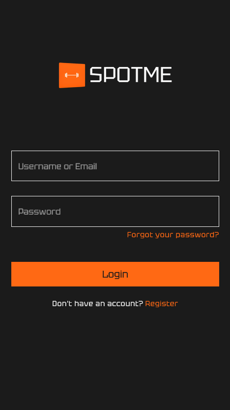

# SpotMe 🏋️‍♂️

A computer vision-based fitness tracker that provides **real-time voice feedback** to help users correct their form while exercising. Designed to assist with posture awareness during strength training.

---

## 🧠 Features

- Real-time body joint detection via webcam
- Voice feedback for correcting form
- Progress tracking for completed workouts

---

## 🔧 Tech Stack

- **Frontend**: HTML, CSS, JavaScript
- **Backend**: Python, Flask
- **Database**: PostgreSQL
- **Computer Vision**: Mediapipe Pose Estimation
- **Others**: Web Speech API (Text-to-Speech)

---

## 📸 Screenshots

> _(Add screenshots or demo GIFs here of the pose detection and dashboard UI.)_


---

## 🚀 How to Run Locally

1. **Clone the repository:**
   ```bash
   git clone https://github.com/saciinol/spot-me.git
   cd spot-me
